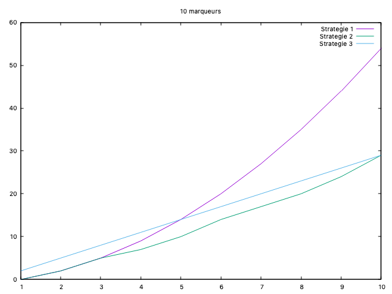
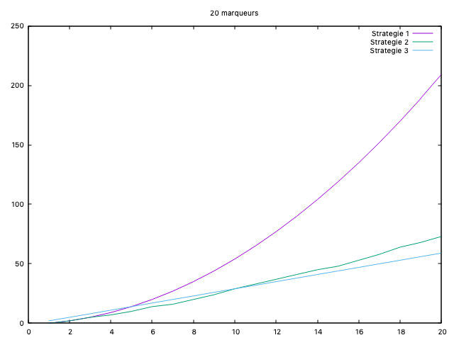
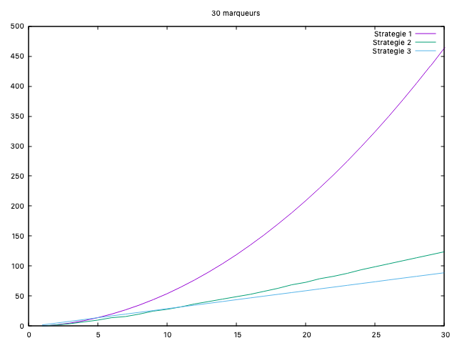
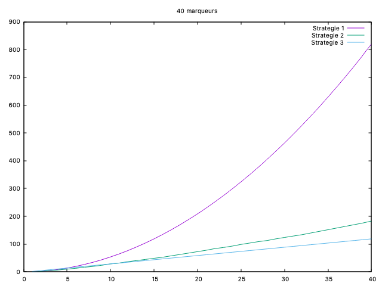
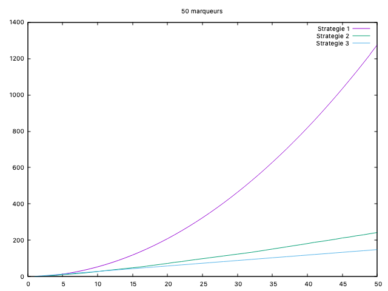
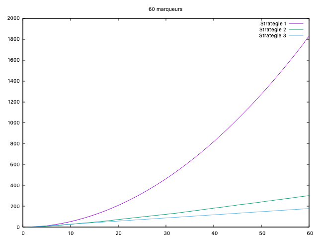
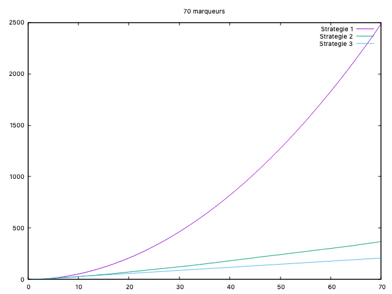
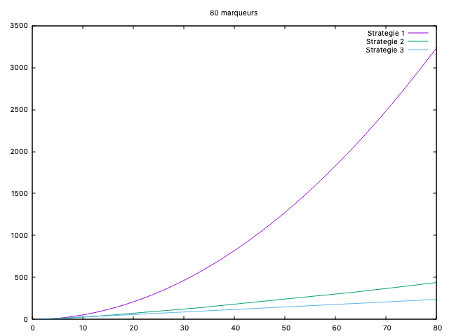
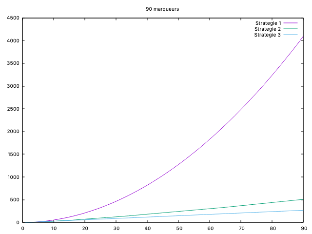
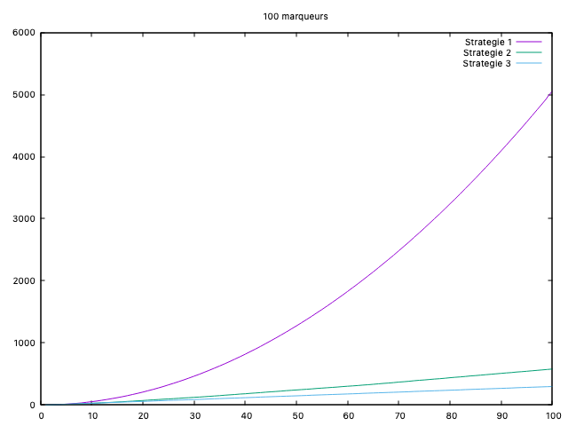

# Tp Expérimentations


## État du TP

Décrivez ici l'état d'avancement du TP.

## Réponses aux questions

Indiquez ici les réponses aux questions posées dans le TP. Vous
reprendrez le numéro de la section et le numéro de la question. Par
exemple pour répondre à la question 3 de la section 2.4 vous indiquerez :

## Stratégie 1

### Question 1.1.a:
Pour analyser la complexité de l'algorithme, je propose de compter le nombre de comparaisons effectuées entre les éléments de la liste des marqueurs `(markers)` et ceux de la liste des marqueurs positifs `(positive)`.

### Question 1.1.b:
Oui, il existe un **pire** des cas pour cet algorithme. Il se produit lorsque tous les marqueurs de la liste markers ne se trouvent pas dans la liste `positive`.

Donc pour chaque marqueur de markers de taille **m**, l’algorithme parcourt entièrement la liste positive de taille **p**.

Donc dans ce **pire** cas, notre algorithme aura besoin de **`m*p`** comparaisons.

### Question 1.1.c:

Dans le **pire** des cas, aucun des marqueurs de la liste `markers` ne se trouve dans la liste `positive`. Cela implique que pour chaque marqueur `m`, nous devons parcourir toute la liste `positive` taille **p** pour pour conclure qu'il est négatif.

Le nombre total de comparaisons dans ce cas est donc:
```math
C1(m,p) = m*p
```
## Stratégie 2

### Question 2.2:

Oui, il existe un pire cas pour cet algorithme qui se produit lorsque, tous les éléments de markers ne sont pas dans positive, obligeant ainsi la l'algrithme essayé tout les cas possibles avant de conclure qu'il es négatif.

##### La borne supérieure pour le nombre d'opérations **`C2(m, p)`**:

L'algorithme `negative_markers2` a besoin en deux étapes principales :

1. Tri de positive avec merge_sort

- Le tri a une complexité en **`O(p log p)`**.

2. Recherche dichotomique pour chaque élément de markers

La recherche dichotomique fait `O(log p)` comparaisons par chaque élément de markers.

Donc comme il y a **m** éléments dans markers, le coût total de cette étape est **`O(m log p)`**.

Donc la borne supérieure pour le nombre d'opérations **`C2(m, p)`** est :

```math
C2(m,p)=O(p*log(p)+m*log(p))
```


## Stratégie 3

### Question 2.2:
Notre algorithme parcourt notre liste de markers qui a pour taille **`m+p`** (liste contenant les markers et les positifs) qu'une seul fois en à chaque élement on fait deux opérations de comparaisons une avec l'élement d'avant et une avec seul après.

Ce qui sera représenté par:
```math
C3_1(m,p)=O(m+p)*2
```
Mais par contre le principal cout utilisé par notre algorithme c'est le cout du **tri**, et le pire du cas dans ce cas sera lié au opération lié à la partie du **tri**, et qui sera que les marqueurs et les marqueurs positifs sont triés dans l’ordre inverse par exemple quand `markers = [10, 8, 6, 4, 2]` et `positive = [9, 7, 5, 3, 1]`.

Ce qui sera représenté par:
```math
C3_2(m,p)=O((m + p) log (m + p))
```

Donc notre borne supérieure **`C3(m, p)`** est :

```math
C3_1(m,p) + C3_2(m,p) = C3(m,p) = O( (m+p) log (m+p) + m + p )
```
## Recherche empirique des cas favorables

### Question 2:

#### Stratégie 1:

La version où cette statégie est plus performante est quand **`m=1000`** et **`p=2`**, ce qui nous fera que **2000 comparaisons** pour 1000 marqueurs.


#### Stratégie 2:
La version où cette statégie est plus performante est quand **`m=100000`** et **`p=100`**, ce qui nous fera que **~7*100000 comparaisons** pour 100000 marqueurs.

#### Stratégie 3:
La version où cette statégie est plus performante est quand **`m=50000`** et **`p=50000`**, ce qui nous fera que **~6*100000 comparaisons** pour 50000 marqueurs.

### Question: D'après vous à quoi peut servir cette variable ?
Cette variable sert à reinitialiser le compteur cpt à chaque appel de fonction pour pouvoir afficher le cpt de chaque stratégie sans les cumuler

## Question 6: Graphes:












### Conclusion:

On peut conclure que pour des petites valeurs de m, les 3 stratégies implémenter dans ce Tp ne présentent pas une grande différences, comme on peut voir dans ce premier graphe de 10 marqueurs:


Par contre une fois que le nombre de marqueurs commence a grandir, on peut clairement voir la différence d'éfficacité entre les 3 stratégies:

- **`Stratégie 1`** est clairement inefficace pour de grandes valeurs de m, car le nombre de comparaisons explose.

- **`Stratégie 2 et 3`** restent beaucoup plus efficaces et montrent que les approches rapporté par les deux étudiants ont bien optimisé les résultats.

Comme on peut voir dans ce dernier graphe de 100 marqueurs:


On peut conclure que la **Stratégie 3** est globalement la meilleure et la plus efficace, car elle maintient un nombre de comparaisons bas par rapport au deux autres stratégie.